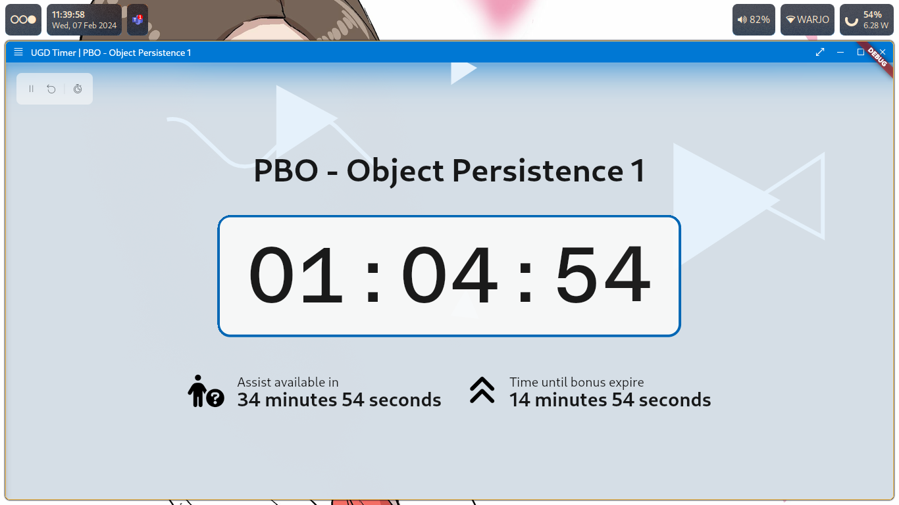

# UGD TIMER

### A simple and elegant timer for use in coding practice class.

---

## Features

- 3 Timers available (main timer, assistant timer, and bonus timer)
- Assistant and bonus timer are toggleable
- Magically perfect display for all screen sizes
- Start-at feature, to start the timer at predetermined time
- Cross platform (Linux, Windows, MacOS (untested))
- 2 languages available (ID, EN) with more to come

#### Planned feature

- Notes window
- Play sound when X happens
- Keyboard shortcuts
